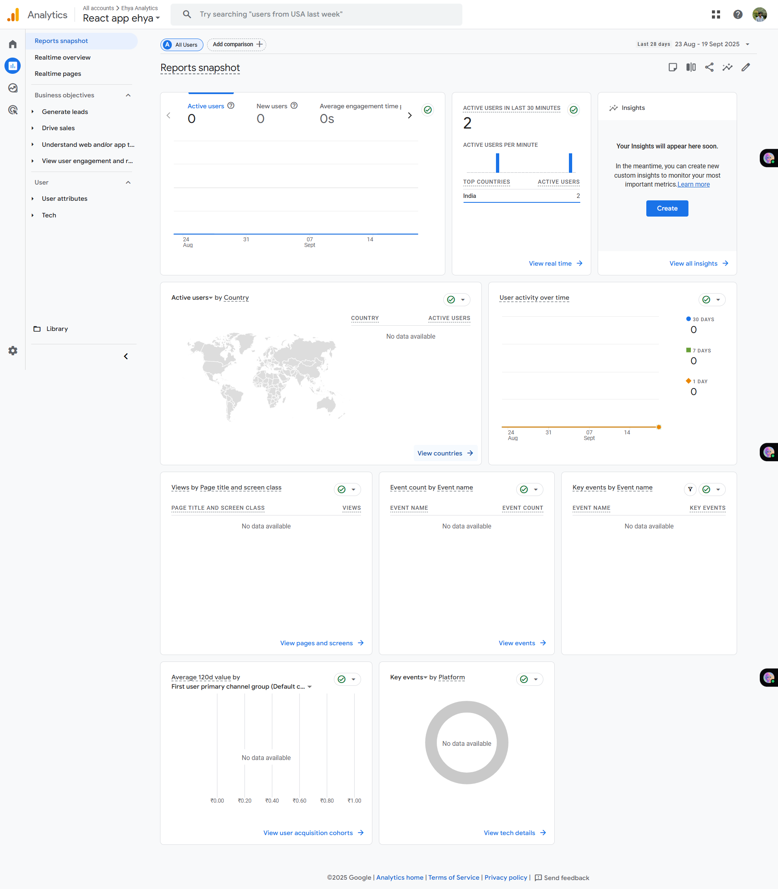
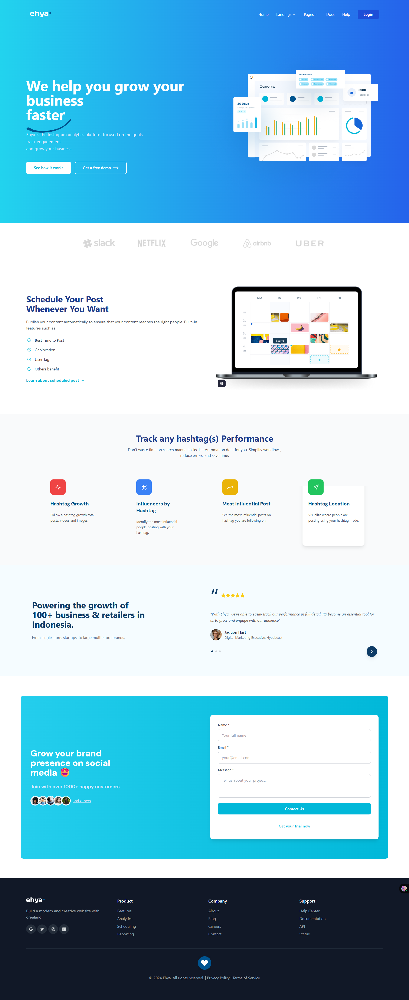

# 📌 Overview -EHYA DASHBOARD 
This project is a recreated landing page based on the given Figma design.
The goal was to build a simple, modern, and responsive page that closely matches the reference design while including the required features.

## Features Implemented
Header with Logo + CTA
Call-to-action (CTA) button for login/demo.

Three Information Sections (Image + Text) and Contact form

Fully responsive design using flexible grids and breakpoints.

Google Analytics Integration

Added via embed code block for tracking visitor activity.

🌐 Live Demo
https://ehya-dashboard-eksr.vercel.app/

⚙️ Tech Stack
Webflow – For building and hosting the landing page.

HTML / CSS / JS (Webflow generated) – For styling and interactivity.
Google Analytics – For tracking user engagement.
The design matches the given Figma layout as closely as possible.
Analytics code snippet was added through Webflow’s Embed Code block

## 📊 Google Analytics Snippet
```html
<script>
  const script = document.createElement("script");
  script.async = true;
  script.src = "https://www.googletagmanager.com/gtag/js?id=G-RCXXXXX";
  document.head.appendChild(script);

  // Configure GA
  const configScript = document.createElement("script");
  configScript.innerHTML = `
    window.dataLayer = window.dataLayer || [];
    function gtag(){dataLayer.push(arguments);}
    gtag('js', new Date());
    gtag('config', 'G-RCYXXXXX');
  `;
  document.head.appendChild(configScript);
</script>
```

## ANALYTICS DASHBOARD 


### Demo Screenshot
